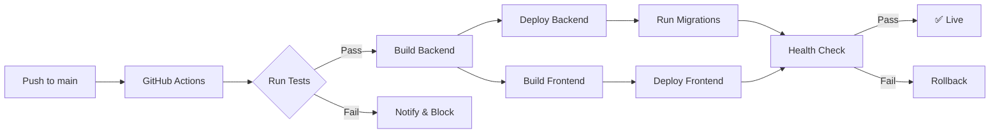

# SERG-ASSTool — Deployment Guide

**Version:** 1.0  
**Date:** 2026-06-17  
**Target:** Azure Cloud & GitHub  
**Stack:** Next.js 16 + Express 4 + MariaDB 10.11 + TypeORM  

---

## Table of Contents

1. [Quick Decision Matrix](#1-quick-decision-matrix)
2. [Architecture Overview](#2-architecture-overview)
3. [Prerequisites](#3-prerequisites)
4. [Option A: One-Click Azure (Bicep IaC)](#4-option-a-one-click-azure-bicep-iac)
5. [Option B: Step-by-Step Azure CLI](#5-option-b-step-by-step-azure-cli)
6. [Option C: GitHub + Any Cloud](#6-option-c-github--any-cloud)
7. [Option D: Docker Anywhere](#7-option-d-docker-anywhere)
8. [CI/CD Pipelines](#8-cicd-pipelines)
9. [Environment Variables Reference](#9-environment-variables-reference)
10. [Verification Checklist](#10-verification-checklist)
11. [Cost Estimates](#11-cost-estimates)
12. [Troubleshooting](#12-troubleshooting)

---

## 1. Quick Decision Matrix

| Your Goal | Recommendation | Time to Deploy |
|-----------|---------------|----------------|
| Fastest path to live | **Option A — Bicep** | ~15 min |
| Full control, step by step | **Option B — Azure CLI** | ~45 min |
| GitHub-centric workflow | **Option C — GitHub + Any Cloud** | ~30 min |
| Self-hosted / VPS / on-prem | **Option D — Docker** | ~20 min |
| Dev/Test only | Docker Compose (see `DEVELOPMENT.md`) | ~2 min |

---

## 2. Architecture Overview

```
┌──────────────────────────────────────────────────────────┐
│                     Internet (HTTPS)                      │
└────────────┬─────────────────────────┬───────────────────┘
             │                         │
             ▼                         ▼
┌────────────────────────┐  ┌──────────────────────────────┐
│  Azure Static Web App  │  │  GitHub Pages / Vercel /     │
│  OR Vercel / Netlify   │  │  Any Static Host             │
│  (Next.js Frontend)    │  │  (Next.js Frontend)          │
│  Port 443              │  │  Port 443                    │
└───────────┬────────────┘  └──────────────┬───────────────┘
            │                              │
            │  REST API (JSON)             │
            ▼                              ▼
┌──────────────────────────────────────────────────────────┐
│               Azure App Service / Docker                  │
│               (Express Backend API)                       │
│               Port 4000                                   │
│               Calculations + Metadata                     │
└───────────┬──────────────────────────────────────────────┘
            │
            │  TypeORM (TLS)
            ▼
┌──────────────────────────────────────────────────────────┐
│     Azure Database for MySQL / MariaDB Docker             │
│     Port 3306                                             │
│     Tables: criteria, evaluations, buildings,             │
│             neb_thresholds, config                         │
└──────────────────────────────────────────────────────────┘
```

**Key Rule:** Frontend NEVER accesses the database directly. All data flows through the REST API.

---

## 3. Prerequisites

### Required for All Options

- [ ] Node.js 20+ installed locally
- [ ] Git installed
- [ ] Azure CLI (`az`) installed — `winget install Microsoft.AzureCLI`
- [ ] Azure subscription (free tier works for testing)

### Required for Azure Options

- [ ] `az login` completed
- [ ] Contributor role on the subscription

### Required for Docker Options

- [ ] Docker Desktop or Docker Engine installed
- [ ] Docker Compose installed

---

## 4. Option A: One-Click Azure (Bicep IaC)

Your project includes a ready-to-use Bicep template at `azure/main.bicep` that provisions **everything** in one command.

### Step 4.1: Deploy Infrastructure

```bash
# From project root
cd azure

# Deploy (creates RG, App Service, MySQL, Static Web App, Key Vault, App Insights)
az deployment sub create \
  --location westeurope \
  --template-file main.bicep \
  --parameters dbPassword="YOUR_DB_PASSWORD" dbAdminPassword="YOUR_ADMIN_PASSWORD"
```

**What this creates (in ~10 minutes):**

| Resource | Name Pattern | Purpose |
|----------|-------------|---------|
| Resource Group | `rg-aas-production` | Container for all resources |
| App Service Plan | `asp-aas-production` | Shared compute (B1 Basic) |
| App Service (Backend) | `app-aas-backend-production` | Express API on Node 20 |
| Static Web App | `stapp-aas-frontend-production` | Next.js frontend |
| MariaDB Server | `mariadb-aas-production` | Managed database |
| MariaDB Database | `mydb` | Application database |
| Application Insights | `appi-aas-production` | Monitoring & logs |
| Log Analytics | `law-aas-production` | Centralized logging |

### Step 4.2: Deploy Code

```bash
# Build backend
cd backend
npm install && npm run build

# Run migrations and seed
npm run migrate
npm run seed

# Deploy to Azure App Service
zip -r deploy.zip dist/ package.json node_modules/
az webapp deploy \
  --resource-group rg-aas-production \
  --name app-aas-backend-production \
  --src-path deploy.zip \
  --type zip

# Frontend auto-deploys via GitHub Actions
# (Static Web App is linked to your GitHub repo)
```

### Step 4.3: Verify

```bash
# Check backend health
curl https://app-aas-backend-production.azurewebsites.net/health

# Check frontend
curl https://stapp-aas-frontend-production.azurestaticapps.net

# Check database connectivity
az mysql flexible-server show \
  --resource-group rg-aas-production \
  --name mariadb-aas-production
```

---

## 5. Option B: Step-by-Step Azure CLI

For full control, provision each service individually.

### Step 5.1: Create Resource Group

```bash
az group create \
  --name rg-aas-prod \
  --location westeurope
```

### Step 5.2: Create MySQL Database

```bash
# Create MySQL Flexible Server
az mysql flexible-server create \
  --resource-group rg-aas-prod \
  --name aas-mysql \
  --location westeurope \
  --admin-user aasadmin \
  --admin-password "STRONG_PASSWORD_123!" \
  --sku-name Standard_B1ms \
  --tier Burstable \
  --storage-size 32 \
  --database-name mydb

# Get connection string
az mysql flexible-server show-connection-string \
  --server aas-mysql \
  --database-name mydb
```

### Step 5.3: Seed the Database

```bash
# Export local Docker DB
docker exec mariadb mysqldump -u myuser -pmypassword mydb > backup.sql

# Import to Azure
az mysql flexible-server execute \
  --name aas-mysql \
  --admin-user aasadmin \
  --admin-password "STRONG_PASSWORD_123!" \
  --file-path backup.sql \
  --database-name mydb
```

### Step 5.4: Deploy Backend to App Service

```bash
# Create App Service Plan (Linux)
az appservice plan create \
  --name plan-aas-backend \
  --resource-group rg-aas-prod \
  --sku B1 \
  --is-linux

# Create Web App
az webapp create \
  --name api-aas-backend \
  --resource-group rg-aas-prod \
  --plan plan-aas-backend \
  --runtime "NODE:20-lts"

# Configure environment
az webapp config appsettings set \
  --resource-group rg-aas-prod \
  --name api-aas-backend \
  --settings \
    DB_HOST="aas-mysql.mysql.database.azure.com" \
    DB_PORT="3306" \
    DB_USER="aasadmin" \
    DB_PASSWORD="STRONG_PASSWORD_123!" \
    DB_NAME="mydb" \
    DB_SSL="true" \
    NODE_ENV="production" \
    PORT="4000"

# Enable Always On & HTTPS
az webapp config set \
  --resource-group rg-aas-prod \
  --name api-aas-backend \
  --always-on true \
  --https-only true

# Build & Deploy
cd backend
npm install && npm run build
zip -r deploy.zip dist/ node_modules/ package.json
az webapp deploy \
  --resource-group rg-aas-prod \
  --name api-aas-backend \
  --src-path deploy.zip \
  --type zip
```

### Step 5.5: Deploy Frontend to Static Web Apps

```bash
# Create Static Web App (linked to GitHub)
az staticwebapp create \
  --name app-aas-frontend \
  --resource-group rg-aas-prod \
  --location westeurope \
  --source https://github.com/YOUR_USERNAME/accessibility-assessment \
  --branch main \
  --app-location "frontend" \
  --output-location ".next" \
  --login-with-github

# Set environment variable
az staticwebapp appsettings set \
  --name app-aas-frontend \
  --setting-names "NEXT_PUBLIC_API_URL=https://api-aas-backend.azurewebsites.net/api/v1"
```

### Step 5.6: Configure CORS on Backend

```bash
# Add CORS allowed origins
az webapp cors add \
  --resource-group rg-aas-prod \
  --name api-aas-backend \
  --allowed-origins \
    "https://app-aas-frontend.azurestaticapps.net" \
    "https://your-custom-domain.com"
```

---

## 6. Option C: GitHub + Any Cloud

Use GitHub as the central source of truth with CI/CD to any cloud.

### Step 6.1: Push to GitHub

```bash
cd c:\Users\yiannis\Desktop\Serg

# Initialize Git
git init
git checkout -b main

# Create .gitignore
cat > .gitignore << 'GITIGNORE'
node_modules/
.next/
dist/
.env
.env.local
*.log
docker-compose.override.yml
*.tsbuildinfo
.vscode/
.DS_Store
Thumbs.db
GITIGNORE

git add .
git commit -m "Initial commit — SERG-ASSTool"

# Push to GitHub
git remote add origin https://github.com/YOUR_USERNAME/accessibility-assessment.git
git push -u origin main
```

### Step 6.2: GitHub Actions — Backend CI/CD

Create `.github/workflows/deploy-backend.yml`:

```yaml
name: Deploy Backend to Azure

on:
  push:
    branches: [main]
    paths:
      - 'backend/**'

env:
  AZURE_WEBAPP_NAME: api-aas-backend
  NODE_VERSION: '20'

jobs:
  build-and-deploy:
    runs-on: ubuntu-latest
    steps:
      - uses: actions/checkout@v4

      - name: Setup Node.js
        uses: actions/setup-node@v4
        with:
          node-version: ${{ env.NODE_VERSION }}

      - name: Install & Build
        working-directory: ./backend
        run: |
          npm ci
          npm run build

      - name: Run Tests
        working-directory: ./backend
        run: npm test

      - name: Deploy to Azure App Service
        uses: azure/webapps-deploy@v3
        with:
          app-name: ${{ env.AZURE_WEBAPP_NAME }}
          publish-profile: ${{ secrets.AZURE_BACKEND_PUBLISH_PROFILE }}
          package: ./backend
```

### Step 6.3: GitHub Actions — Frontend CI/CD

Create `.github/workflows/deploy-frontend.yml`:

```yaml
name: Deploy Frontend to Azure Static Web Apps

on:
  push:
    branches: [main]
    paths:
      - 'frontend/**'

jobs:
  build-and-deploy:
    runs-on: ubuntu-latest
    steps:
      - uses: actions/checkout@v4

      - name: Setup Node.js
        uses: actions/setup-node@v4
        with:
          node-version: '20'

      - name: Build
        working-directory: ./frontend
        run: |
          npm ci
          npm run build

      - name: Deploy to Static Web Apps
        uses: Azure/static-web-apps-deploy@v1
        with:
          azure_static_web_apps_api_token: ${{ secrets.AZURE_STATIC_WEB_APP_TOKEN }}
          repo_token: ${{ secrets.GITHUB_TOKEN }}
          action: upload
          app_location: frontend
          output_location: .next
```

### Step 6.4: Set GitHub Secrets

In GitHub → Repository → Settings → Secrets and variables → Actions:

| Secret Name | Value | Where to Find |
|-------------|-------|---------------|
| `AZURE_BACKEND_PUBLISH_PROFILE` | (XML profile) | Azure Portal → App Service → Download publish profile |
| `AZURE_STATIC_WEB_APP_TOKEN` | (deployment token) | Azure Portal → Static Web App → Manage deployment token |

### Step 6.5: Alternative — Deploy to Vercel + Railway

If you prefer non-Azure services:

**Frontend (Vercel):**
```bash
# Install Vercel CLI
npm i -g vercel

cd frontend
vercel --prod

# Set env var in Vercel dashboard:
# NEXT_PUBLIC_API_URL = https://your-backend.railway.app/api/v1
```

**Backend (Railway):**
```bash
# Push to GitHub, then in Railway:
# 1. New Project → Deploy from GitHub repo
# 2. Set root directory to /backend
# 3. Add MySQL plugin for database
# 4. Set environment variables (see Section 9)
```

---

## 7. Option D: Docker Anywhere

### Step 7.1: Create Backend Dockerfile

Create `backend/Dockerfile`:

```dockerfile
FROM node:20-alpine AS builder
WORKDIR /build
COPY package*.json ./
RUN npm ci
COPY tsconfig.json ./
COPY src/ ./src/
RUN npm run build

FROM node:20-alpine
WORKDIR /app
COPY --from=builder /build/package*.json ./
COPY --from=builder /build/node_modules/ ./node_modules/
COPY --from=builder /build/dist/ ./dist/
EXPOSE 4000
CMD ["node", "dist/index.js"]
```

### Step 7.2: Create Production Docker Compose

Create `docker-compose.prod.yml`:

```yaml
version: '3.8'
services:
  backend:
    build: ./backend
    ports:
      - "4000:4000"
    environment:
      DB_HOST: mariadb
      DB_PORT: "3306"
      DB_USER: aasuser
      DB_PASSWORD: ${DB_PASSWORD}
      DB_NAME: mydb
      NODE_ENV: production
      PORT: "4000"
    depends_on:
      mariadb:
        condition: service_healthy
    restart: unless-stopped

  mariadb:
    image: mariadb:10.11
    environment:
      MYSQL_ROOT_PASSWORD: ${DB_ROOT_PASSWORD}
      MYSQL_DATABASE: mydb
      MYSQL_USER: aasuser
      MYSQL_PASSWORD: ${DB_PASSWORD}
    volumes:
      - mariadb_data:/var/lib/mysql
      - ./backend/docker-initdb.d:/docker-entrypoint-initdb.d:ro
    healthcheck:
      test: ["CMD", "mariadb-admin", "ping", "-h", "localhost"]
      interval: 10s
      timeout: 5s
      retries: 5
    restart: unless-stopped

  frontend:
    build: ./frontend
    ports:
      - "3000:3000"
    environment:
      NEXT_PUBLIC_API_URL: http://backend:4000/api/v1
    depends_on:
      - backend
    restart: unless-stopped

volumes:
  mariadb_data:
```

### Step 7.3: Deploy with Docker

```bash
# Create .env file
echo "DB_PASSWORD=your_secure_password" > .env
echo "DB_ROOT_PASSWORD=your_root_password" >> .env

# Start everything
docker compose -f docker-compose.prod.yml up -d

# Run migrations & seed (one-time)
docker compose -f docker-compose.prod.yml exec backend npm run migrate
docker compose -f docker-compose.prod.yml exec backend npm run seed

# Verify
curl http://localhost:4000/health
curl http://localhost:3000
```

---

## 8. CI/CD Pipelines

### 8.1 Recommended Pipeline



### 8.2 Pull Request Preview

For Azure Static Web Apps, PRs automatically get staging URLs:

```
https://stapp-aas-frontend-production-<pr-number>.azurestaticapps.net
```

### 8.3 Rollback

```bash
# Backend — redeploy previous version
az webapp deployment source config-zip \
  --resource-group rg-aas-prod \
  --name api-aas-backend \
  --src previous-deploy.zip

# Frontend — revert commit in GitHub
git revert HEAD --no-edit
git push
```

---

## 9. Environment Variables Reference

### Backend

| Variable | Required | Default | Description |
|----------|----------|---------|-------------|
| `PORT` | No | `4000` | Server listen port |
| `DB_HOST` | Yes | `127.0.0.1` | Database hostname |
| `DB_PORT` | No | `3306` | Database port |
| `DB_USER` | Yes | `myuser` | Database username |
| `DB_PASSWORD` | Yes | — | Database password |
| `DB_NAME` | No | `mydb` | Database name |
| `DB_SSL` | No | `false` | Enable TLS (`true` for Azure) |
| `NODE_ENV` | No | `development` | Environment mode |
| `CORS_ORIGIN` | No | `*` | Allowed CORS origin |

### Frontend

| Variable | Required | Default | Description |
|----------|----------|---------|-------------|
| `NEXT_PUBLIC_API_URL` | Yes | `http://localhost:4000/api/v1` | Backend API base URL |

### Setting in Azure

```bash
# Bulk set via CLI
az webapp config appsettings set \
  --resource-group rg-aas-prod \
  --name api-aas-backend \
  --settings \
    DB_HOST="aas-mysql.mysql.database.azure.com" \
    DB_PORT="3306" \
    DB_USER="aasadmin" \
    DB_NAME="mydb" \
    DB_SSL="true" \
    NODE_ENV="production" \
    CORS_ORIGIN="https://app-aas-frontend.azurestaticapps.net"
```

---

## 10. Verification Checklist

After deployment, verify each layer:

### ✅ Database

```bash
# Connect and check tables
az mysql flexible-server connect \
  --name aas-mysql \
  --admin-user aasadmin \
  --database-name mydb

# In MySQL prompt:
SHOW TABLES;           -- Should show: criteria, evaluations, buildings, etc.
SELECT COUNT(*) FROM criteria;  -- Should return 63
```

### ✅ Backend API

```bash
# Health check
curl https://api-aas-backend.azurewebsites.net/health

# Config endpoint (verifies DB connectivity)
curl https://api-aas-backend.azurewebsites.net/api/v1/config

# Evaluation endpoint (verifies calculation engine)
curl -X POST https://api-aas-backend.azurewebsites.net/api/v1/evaluate \
  -H "Content-Type: application/json" \
  -d '{"buildingType":"Commercial Buildings","scores":{"C1":3,"C2":4}}'
```

### ✅ Frontend

```bash
# Homepage loads
curl -I https://app-aas-frontend.azurestaticapps.net

# JavaScript bundles served
curl https://app-aas-frontend.azurestaticapps.net/_next/static/chunks/main-app.js | head -c 100
```

### ✅ Full Stack Integration

1. Open `https://app-aas-frontend.azurestaticapps.net` in a browser
2. Navigate to `/dashboard`
3. Select a building type and adjust scores
4. Verify OBS gauge updates
5. Verify NEB class and score calculate correctly

---

## 11. Cost Estimates

### Azure (Monthly — Production)

| Service | SKU | Est. Monthly Cost |
|---------|-----|-------------------|
| App Service Plan | B1 (1 core, 1.75 GB) | ~$13 |
| MySQL Flexible Server | B1ms (1 vCore, 2 GB) | ~$18 |
| Static Web Apps | Free tier | $0 |
| Application Insights | 5 GB logs | ~$3 |
| Key Vault | Free tier | $0 |
| **Total** | | **~$34/month** |

### Azure (Monthly — Dev/Test)

| Service | SKU | Est. Monthly Cost |
|---------|-----|-------------------|
| App Service Plan | F1 (Free) | $0 |
| MySQL Flexible Server | B1ms (Burstable) | ~$18 |
| Static Web Apps | Free tier | $0 |
| **Total** | | **~$18/month** |

### Docker Self-Hosted (Monthly)

| Provider | Spec | Est. Monthly Cost |
|----------|------|-------------------|
| Hetzner VPS | CX22 (2 vCPU, 4 GB) | ~$4 |
| DigitalOcean | Basic Droplet (1 vCPU, 1 GB) | ~$6 |
| Linode | Shared (1 vCPU, 1 GB) | ~$5 |

---

## 12. Troubleshooting

| Problem | Likely Cause | Solution |
|---------|-------------|----------|
| Backend returns 500 | DB connection string wrong | Check `DB_HOST`, `DB_SSL` settings |
| Backend returns 503 | App Service stopped | Enable "Always On" in App Service settings |
| CORS errors in browser | Origin not whitelisted | Add frontend URL to `CORS_ORIGIN` env var |
| Frontend can't reach API | Wrong `NEXT_PUBLIC_API_URL` | Verify env var in Static Web App settings |
| "Table doesn't exist" | Migrations not run | Run `npm run migrate` on backend |
| Slow first load | Cold start on free tier | Upgrade to B1 tier with Always On |
| Database connection refused | Firewall blocking IP | Add App Service outbound IP to MySQL firewall |
| SSL error connecting to DB | `rejectUnauthorized` | Set `DB_SSL=true` and use Azure's CA |

### Quick Diagnostic Commands

```bash
# Check backend logs
az webapp log tail \
  --resource-group rg-aas-prod \
  --name api-aas-backend

# Check deployment status
az webapp deployment list-publishing-profiles \
  --resource-group rg-aas-prod \
  --name api-aas-backend

# Test DB connectivity from App Service
az webapp ssh \
  --resource-group rg-aas-prod \
  --name api-aas-backend

# Check Static Web App workflow runs
# In GitHub → Actions tab → Static Web Apps CI/CD
```

---

## Appendix A: Full Bicep Template

Your project includes this at `azure/main.bicep`. Deploy with:

```bash
az deployment sub create \
  --location westeurope \
  --template-file azure/main.bicep \
  --parameters dbPassword="..." dbAdminPassword="..."
```

The template creates: Resource Group, App Service Plan, Backend App Service, Static Web App, MariaDB Server + Database, Firewall Rules, Application Insights, and Log Analytics Workspace — all in one deployment.

## Appendix B: GitHub Actions Workflow Files

Place these in `.github/workflows/`:

- `deploy-backend.yml` — builds, tests, and deploys backend on push to main
- `deploy-frontend.yml` — builds and deploys frontend on push to main

See Section 6 for complete YAML examples.

## Appendix C: Quick Start Script

Save as `deploy-azure.sh`:

```bash
#!/bin/bash
set -e

echo "=== SERG-ASSTool — Azure Deployment ==="

# Check prerequisites
command -v az >/dev/null 2>&1 || { echo "Install Azure CLI first"; exit 1; }
az account show >/dev/null 2>&1 || { echo "Run 'az login' first"; exit 1; }

# Get secrets
read -sp "DB password: " DB_PASSWORD; echo
read -sp "DB admin password: " DB_ADMIN_PASSWORD; echo

echo "Deploying infrastructure..."
az deployment sub create \
  --location westeurope \
  --template-file azure/main.bicep \
  --parameters dbPassword="$DB_PASSWORD" dbAdminPassword="$DB_ADMIN_PASSWORD"

echo "Building backend..."
cd backend && npm ci && npm run build

echo "Deploying backend..."
zip -r deploy.zip dist/ package.json node_modules/
az webapp deploy \
  --resource-group rg-aas-production \
  --name app-aas-backend-production \
  --src-path deploy.zip \
  --type zip

echo "✅ Deployment complete!"
echo "Backend:  https://app-aas-backend-production.azurewebsites.net/health"
echo "Frontend: https://stapp-aas-frontend-production.azurestaticapps.net"
```

---

**Support:** Refer to `docs/azure-migration.md` for migration-specific details.  
**Infrastructure:** Code is in `azure/main.bicep`.  
**CI/CD:** Workflow templates in Section 6 above.
